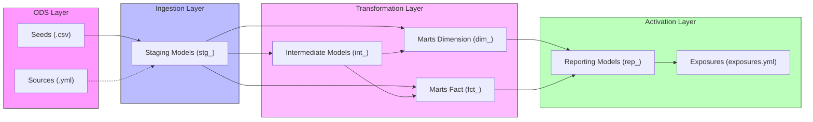

# Metrify Case Study

This project implements the analytics engineering pipeline using DBT for Pipedrive CRM data.

## Getting Started

### 0. Prerequisites
- Install and run [Docker Desktop](https://www.docker.com/products/docker-desktop/).
- Install `uv` (recommended) or `pip` on your machine.

### 1. Spin up Postgres
```bash
docker compose up -d
```
*Credentials: `localhost:5432` | User: `admin` | Password: `admin` | DB: `postgres`*

### 2. Setup Environment & Run DBT
Using `uv` (recommended):
```bash
uv venv && source .venv/bin/activate && uv pip install -r pyproject.toml
```
Or using `pip`:
```bash
pip install dbt-core dbt-postgres
```

Then run the pipeline:
```bash
dbt deps && dbt build
```

### 3. View DBT Documentation (Optional)
Generate the catalog metadata and launch the interactive documentation site:
```bash
uv run dbt docs generate && uv run dbt docs serve
```
Once started, view the pipeline catalog and lineage graphs in your browser at: http://localhost:8080


---

# Data Modeling Practices
This project adheres to modern analytics engineering standards by combining **[Dimensional Modeling](https://en.wikipedia.org/wiki/Dimensional_modeling)** principles (Kimball methodology adapted for modern cloud data warehouses) with the official **[dbt Labs Best Practice Guide on project structure](https://docs.getdbt.com/guides/best-practices/how-we-structure/1-guide-overview)**. 

Our practices focus on modularity, clear grain definition, schema separation, tool-agnostic interfaces in presentation layers, and incremental processing for performance.



We partition our logic into distinct layers, each with dedicated responsibilities:
- **ODS (Operational Data Store) Ingestion Layer**: Handles raw data connections and ingestion into the warehouse database:
  - **Source Layer (`models/sources.yml`)**: Declares raw connection namespaces for external database tables. *(Note: Not utilized in this project as raw inputs are static CSVs loaded via the Seed layer).*
  - **Seed Layer (`seeds/`)**: Manages the ingestion of small, static lookup datasets directly from version-controlled CSV files. See the [Seeds Layer Guide](seeds/README.md) for details on static inputs and configurations.
- **Staging Layer (`models/staging/`)**: Contains models that have direct 1:1 relationships with our raw source tables. They perform light cleaning, renaming, casting, and timezone conversion. See the [Staging Architecture Guide](models/staging/README.md) for details on naming conventions, directory layout, and configurations.
- **Intermediate Layer (`models/intermediate/`)**: Contains models representing reusable business logic transformations. See the [Intermediate Architecture Guide](models/intermediate/README.md) for details on modular logic boundaries.
- **Marts Layer (`models/marts/`)**: Contains the business-ready presentation models. See the [Marts Architecture Guide](models/marts/README.md) for details on our design principles and mart classifications:
  - **Dimension Tables (`dim_`)**: Descriptive entities (e.g. `dim_crm_users`).
  - **Fact Tables (`fct_`)**: Action/event-based metrics (e.g. `fct_crm_activities`).
- **Reporting Layer (`models/reporting/`)**: Dedicated presentation layer positioned downstream of the Marts layer, aggregating metrics specifically for BI dashboards and final reporting (e.g. `rep_sales_funnel_monthly`). See the [Reporting Architecture Guide](models/reporting/README.md) for details on custom schemas, dense grid backbone logic, and testing.
- **Exposure Layer (`models/exposures.yml`)**: Defines downstream data consumers (e.g., specific dashboards or reports) to document end-to-end lineage within the dbt DAG. This completes the DAG lineage beyond dbt, enabling impact analysis (e.g. knowing which dashboards are affected if a mart table changes).
  - *Current Exposure*: `sales_funnel_monthly_dashboard` (declares the monthly sales funnel dashboard as a consumer of `rep_sales_funnel_monthly`).
  - *Future Exposures*: Can represent Metabase/Looker/Tableau dashboards, Census/Hightouch reverse ETL syncs, or ML feature stores.


# Folder Structures & Project Organization
We structure our files in the repository as follows:
```text
dbt_enpal_assessment/
├── seeds/                         # Raw static lookup files (CSV)
├── models/
│   ├── exposures.yml              # Downstream consumer definitions
│   │
│   ├── staging/                   # Ingestion Layer (1:1 with source tables)
│   │   └── pipedrive/             # Subfolder per source application (e.g. Pipedrive)
│   │       ├── configs/           # Centralized staging schema configuration
│   │       └── s_pipedrive__stg_*.sql # Standardized casting & cleaning models
│   │
│   ├── intermediate/              # Modular Layer (transitional reusable logic)
│   │   └── int_*.sql              # Joins and pre-aggregations
│   │
│   ├── marts/                     # Core Marts Layer (presentation layer)
│   │   ├── configs/               # Centralized marts configuration
│   │   ├── dim_*.sql              # Dimension tables (CRM entities)
│   │   └── fct_*.sql              # Fact tables (Process events)
│   │
│   └── reporting/                 # Downstream Presentation Layer
│       └── rep_*.sql              # BI-ready monthly funnel reports
├── dbt_project.yml                # Main configuration file for the dbt project
├── packages.yml                   # Lists external dbt packages (e.g. dbt_utils)
├── profiles.yml                   # Connection configurations for the warehouse target
├── docker-compose.yml             # Manages local Postgres test database service configuration
├── init.sql                       # Database initialization script executed on container startup
├── .python-version                # Declares the required Python runtime version
├── pyproject.toml                 # Configures Python packaging and dependencies (dbt-core, etc.)
├── uv.lock                        # Lockfile generated by uv for reproducible virtual environments
├── .gitignore                     # Lists files and folders intentionally untracked by Git
└── package-lock.yml               # Node package manager lockfile (if package files are generated)
```

---

# Engineering Conventions

## 1. Schema Configurations
- Staging models are configured to build into a dedicated schema named exactly `staging` (instead of appending a target prefix). This is accomplished via a custom macro overriding `generate_schema_name` ([generate_schema_name.sql](../macros/generate_schema_name.sql)).

## 2. Primary Key Validation & Testing
- Every staging model configures data validation tests on its primary key (e.g., `unique` and `not_null` constraints on `activity_type_id` and `field_id`) in its respective YML configuration file to guarantee data integrity at the entry point of the pipeline.

## 3. Timezone Handling
- **Timezone Conversion**: Metrify currently operates exclusively in the Germany market and the team is located in Berlin. Source data from Pipedrive is provided in UTC by default. To align analytics and reports with local operations, all UTC timestamps are converted to the `Europe/Berlin` timezone in the staging layer models (e.g. `due_at` in [stg_pipedrive_activities.sql](../models/staging/stg_pipedrive_activities.sql)).

## 4. JSON Unnesting (CRM Fields)
- **JSON Options Unnesting**: Staged CRM field definitions include a JSON column `field_value_options` containing an array of key-value pairs (id and label options). To hide the complexity of JSON arrays from business stakeholders and ensure query performance at scale, we unnested these values into a dedicated `dim_crm_field_options` table (configured as a separate dimension in the marts layer). The raw JSON column is excluded from the main `dim_crm_fields` dimension table.

## 5. Incremental Materialization Strategy
- **Incremental Materialization**: The heavy marts fact tables (`mart__fct_crm_activities` and `mart__fct_crm_deal_changes`) are materialized as `incremental` to optimize query performance and reduce processing costs.
- **Schema Evolution Policy**:
  - The project-wide default is configured in `dbt_project.yml` as `+on_schema_change: "append_new_columns"`. This default is chosen because automatically syncing column removals or renames in production is risky; it should remain a manual, intentional action. Silent column drops or renames can easily break downstream dependencies, such as reporting dashboards, BI tools, or other dependent dbt models.
  - The two marts fact tables override this with `on_schema_change='sync_all_columns'` to automatically handle added, renamed, or deleted columns.
- **Reusable Filtering Macro**: Created the `get_incremental_date_filter` macro ([get_incremental_date_filter.sql](file:///Users/jimmypang/AntigravityProjects/dbt_enpal_assessment/macros/get_incremental_date_filter.sql)) to safely handle postgres timestamp/date filtering within subqueries to avoid aggregate/correlation errors.
- **Upstream Performance Filtering**:
  - In `mart__fct_crm_activities.sql`, we filter records early within the `activities` CTE before joining to `activity_types`.
  - In `mart__fct_crm_deal_changes.sql`, we compute the `LAG()` function over the full history in `deal_changes_raw` (retaining window calculation correctness), and then apply the incremental filter directly in the `deal_changes` CTE. This ensures downstream joins are only processed for the new incremental rows.

# Governance & Guardrails

## Proposed Gitignoring Policy for `target/` Directory
- We considered adding the `target/` folder to `.gitignore` since committing artifacts of every dbt invocation (such as compiled SQL, manifest files, and run results) is not useful and adds unnecessary noise to the repository.
- However, we chose to keep it in git tracking for **interview purposes only** to make it easy to inspect generated files without requiring local database runs. In a production environment, we would absolutely ignore `target/` unless a very clear use case exists.

## PII & GDPR Compliance
- **GDPR Policy**: The staging users model (`stg_pipedrive_users`) ingests PII columns (`user_name`, `email`) directly from raw sources to capture the full source schema.
- **Internal Employees Assumption**: All users are assumed to be Metrify internal employees. Therefore, PII (name and email) is kept directly in the main dimension table (`dim_crm_users`) without a separate restricted PII schema or access request process.
- **Data Retention Policy**: To comply with GDPR guidelines, user data in `dim_crm_users` is proposed to be excluded or deleted if it is older than 6 months (based on `modified_at_utc`). The exact details of this mechanism must be aligned with the Data Protection Officer (DPO), specifically:
  - Confirming the exact retention window (6 months vs. other regulatory periods).
  - Deciding between physical deletion (hard/soft delete in the database) vs. logical filtering at query/view level.
  - Ensuring upstream/downstream impact analysis is done for historical tracking and reporting purposes.

## Proposed CI/CD Best Practices & Governance
To guarantee long-term pipeline stability, we propose establishing a CI/CD workflow that catches syntax, logic, and style issues on every pull request:
- **Linting (`sqlfluff`)**: Integrate a SQL linter (like [sqlfluff](https://sqlfluff.com/)) in the CI pipeline to enforce SQL style guides, casing conventions, and trailing comma rules automatically.
- **`dbt compile` Checks**: The CI pipeline should run `dbt compile` on every PR to verify syntax correctness, project configuration compliance, and macro resolutions.
- **Dry-Run in Ephemeral database**: Run modified dbt models against an ephemeral/temporary schema to perform a full dry-run execution and verify query execution.
- **Pull Request Template**: Enforce a standardized Pull Request template so that all developers document changes, catalog schemas, and list validation results consistently.


---

## Original Assignment Specification

### Funnel Steps (KPIs)
- **Step 1**: Lead Generation
- **Step 2**: Qualified Lead
  - **Step 2.1**: Sales Call 1
- **Step 3**: Needs Assessment
  - **Step 3.1**: Sales Call 2
- **Step 4**: Proposal/Quote Preparation
- **Step 5**: Negotiation
- **Step 6**: Closing
- **Step 7**: Implementation/Onboarding
- **Step 8**: Follow-up/Customer Success
- **Step 9**: Renewal/Expansion

### Reporting Model Schema
- `month`
- `kpi_name`
- `funnel_step`
- `deals_count`
