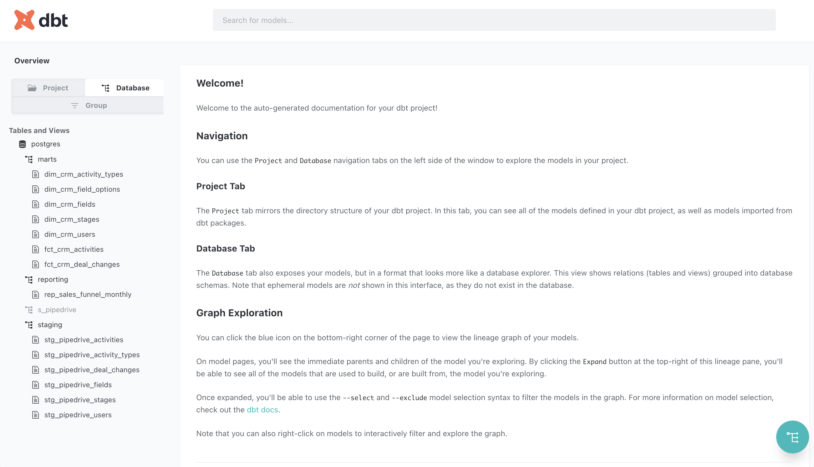
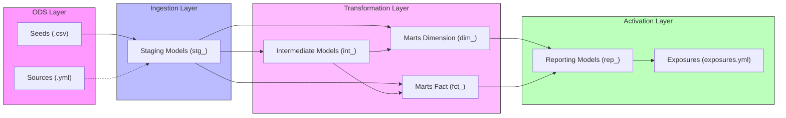
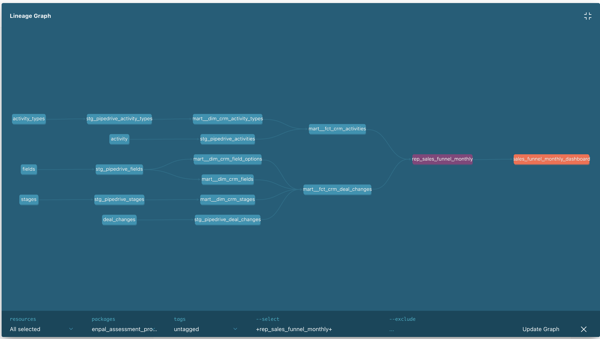

# Metrify Case Study

This project implements the analytics engineering pipeline using DBT for Pipedrive CRM data.

## Getting Started

### 0. Prerequisites
- Install and run [Docker Desktop](https://www.docker.com/products/docker-desktop/).
- Install `uv` (recommended) or `pip` on your machine.

### 1. Spin up Postgres
```bash
docker compose up -d
```
*Credentials: `localhost:5432` | User: `admin` | Password: `admin` | DB: `postgres`*

### 2. Setup Environment & Run DBT
Using `uv` (recommended):
```bash
uv venv && source .venv/bin/activate && uv pip install -r pyproject.toml
```
Or using `pip`:
```bash
pip install dbt-core dbt-postgres
```

Then run the pipeline:
```bash
dbt deps && dbt build
```
Example logs:

```bash
jimmypang@bee40d28-db24-43be-8eeb-d133ad959530 dbt_enpal_assessment % uv run dbt build
15:15:09  Running with dbt=1.11.11
15:15:09  Registered adapter: postgres=1.10.2
15:15:10  [WARNING]: Configuration paths exist in your dbt_project.yml file which do not apply to any resources.
There are 1 unused configuration paths:
- models.enpal_assessment_project.intermediate
15:15:10  Found 14 models, 6 seeds, 34 data tests, 6 sources, 1 exposure, 593 macros
15:15:10  
15:15:10  Concurrency: 1 threads (target='dev')
15:15:10  
15:15:11  1 of 55 START seed file s_pipedrive.activity ................................... [RUN]
15:15:11  1 of 55 OK loaded seed file s_pipedrive.activity ............................... [INSERT 4579 in 0.91s]
15:15:11  2 of 55 START seed file s_pipedrive.activity_types ............................. [RUN]
15:15:11  2 of 55 OK loaded seed file s_pipedrive.activity_types ......................... [INSERT 4 in 0.03s]
15:15:11  3 of 55 START seed file s_pipedrive.deal_changes ............................... [RUN]
15:15:13  3 of 55 OK loaded seed file s_pipedrive.deal_changes ........................... [INSERT 15406 in 1.74s]
15:15:13  4 of 55 START seed file s_pipedrive.fields ..................................... [RUN]
15:15:13  4 of 55 OK loaded seed file s_pipedrive.fields ................................. [INSERT 4 in 0.03s]
15:15:13  5 of 55 START seed file s_pipedrive.stages ..................................... [RUN]
15:15:13  5 of 55 OK loaded seed file s_pipedrive.stages ................................. [INSERT 9 in 0.03s]
15:15:13  6 of 55 START seed file s_pipedrive.users ...................................... [RUN]
15:15:14  6 of 55 OK loaded seed file s_pipedrive.users .................................. [INSERT 1787 in 0.28s]
15:15:14  7 of 55 START sql view model staging.stg_pipedrive_activities .................. [RUN]
15:15:14  7 of 55 OK created sql view model staging.stg_pipedrive_activities ............. [CREATE VIEW in 0.08s]
15:15:14  8 of 55 START sql view model staging.stg_pipedrive_activity_types .............. [RUN]
15:15:14  8 of 55 OK created sql view model staging.stg_pipedrive_activity_types ......... [CREATE VIEW in 0.04s]
15:15:14  9 of 55 START sql view model staging.stg_pipedrive_deal_changes ................ [RUN]
15:15:14  9 of 55 OK created sql view model staging.stg_pipedrive_deal_changes ........... [CREATE VIEW in 0.04s]
15:15:14  10 of 55 START sql view model staging.stg_pipedrive_fields ..................... [RUN]
15:15:14  10 of 55 OK created sql view model staging.stg_pipedrive_fields ................ [CREATE VIEW in 0.03s]
15:15:14  11 of 55 START sql view model staging.stg_pipedrive_stages ..................... [RUN]
15:15:14  11 of 55 OK created sql view model staging.stg_pipedrive_stages ................ [CREATE VIEW in 0.04s]
15:15:14  12 of 55 START sql view model staging.stg_pipedrive_users ...................... [RUN]
15:15:14  12 of 55 OK created sql view model staging.stg_pipedrive_users ................. [CREATE VIEW in 0.03s]
15:15:14  13 of 55 START test not_null_stg_pipedrive_activities_activity_id .............. [RUN]
15:15:14  13 of 55 PASS not_null_stg_pipedrive_activities_activity_id .................... [PASS in 0.04s]
15:15:14  14 of 55 START test unique_stg_pipedrive_activities_activity_id ................ [RUN]
15:15:14  14 of 55 PASS unique_stg_pipedrive_activities_activity_id ...................... [PASS in 0.03s]
15:15:14  15 of 55 START test not_null_stg_pipedrive_activity_types_activity_type_id ..... [RUN]
15:15:14  15 of 55 PASS not_null_stg_pipedrive_activity_types_activity_type_id ........... [PASS in 0.02s]
15:15:14  16 of 55 START test unique_stg_pipedrive_activity_types_activity_type_id ....... [RUN]
15:15:14  16 of 55 PASS unique_stg_pipedrive_activity_types_activity_type_id ............. [PASS in 0.03s]
15:15:14  17 of 55 START test not_null_stg_pipedrive_deal_changes_deal_change_id ......... [RUN]
15:15:14  17 of 55 PASS not_null_stg_pipedrive_deal_changes_deal_change_id ............... [PASS in 0.04s]
15:15:14  18 of 55 START test unique_stg_pipedrive_deal_changes_deal_change_id ........... [RUN]
15:15:14  18 of 55 PASS unique_stg_pipedrive_deal_changes_deal_change_id ................. [PASS in 0.06s]
15:15:14  19 of 55 START test not_null_stg_pipedrive_fields_field_id ..................... [RUN]
15:15:14  19 of 55 PASS not_null_stg_pipedrive_fields_field_id ........................... [PASS in 0.02s]
15:15:14  20 of 55 START test unique_stg_pipedrive_fields_field_id ....................... [RUN]
15:15:14  20 of 55 PASS unique_stg_pipedrive_fields_field_id ............................. [PASS in 0.02s]
15:15:14  21 of 55 START test not_null_stg_pipedrive_stages_stage_id ..................... [RUN]
15:15:14  21 of 55 PASS not_null_stg_pipedrive_stages_stage_id ........................... [PASS in 0.02s]
15:15:14  22 of 55 START test unique_stg_pipedrive_stages_stage_id ....................... [RUN]
15:15:14  22 of 55 PASS unique_stg_pipedrive_stages_stage_id ............................. [PASS in 0.02s]
15:15:14  23 of 55 START test not_null_stg_pipedrive_users_user_id ....................... [RUN]
15:15:14  23 of 55 PASS not_null_stg_pipedrive_users_user_id ............................. [PASS in 0.02s]
15:15:14  24 of 55 START test unique_stg_pipedrive_users_user_id ......................... [RUN]
15:15:14  24 of 55 PASS unique_stg_pipedrive_users_user_id ............................... [PASS in 0.02s]
15:15:14  25 of 55 START sql table model marts.dim_crm_activity_types .................... [RUN]
15:15:14  25 of 55 OK created sql table model marts.dim_crm_activity_types ............... [SELECT 4 in 0.05s]
15:15:14  26 of 55 START sql table model marts.dim_crm_field_options ..................... [RUN]
15:15:14  26 of 55 OK created sql table model marts.dim_crm_field_options ................ [SELECT 14 in 0.04s]
15:15:14  27 of 55 START sql table model marts.dim_crm_fields ............................ [RUN]
15:15:14  27 of 55 OK created sql table model marts.dim_crm_fields ....................... [SELECT 4 in 0.04s]
15:15:14  28 of 55 START sql table model marts.dim_crm_stages ............................ [RUN]
15:15:14  28 of 55 OK created sql table model marts.dim_crm_stages ....................... [SELECT 9 in 0.04s]
15:15:14  29 of 55 START sql table model marts.dim_crm_users ............................. [RUN]
15:15:14  29 of 55 OK created sql table model marts.dim_crm_users ........................ [SELECT 1787 in 0.06s]
15:15:14  30 of 55 START test not_null_mart__dim_crm_activity_types_activity_type_id ..... [RUN]
15:15:14  30 of 55 PASS not_null_mart__dim_crm_activity_types_activity_type_id ........... [PASS in 0.02s]
15:15:14  31 of 55 START test unique_mart__dim_crm_activity_types_activity_type_id ....... [RUN]
15:15:14  31 of 55 PASS unique_mart__dim_crm_activity_types_activity_type_id ............. [PASS in 0.02s]
15:15:14  32 of 55 START test not_null_mart__dim_crm_field_options_field_id .............. [RUN]
15:15:14  32 of 55 PASS not_null_mart__dim_crm_field_options_field_id .................... [PASS in 0.02s]
15:15:14  33 of 55 START test not_null_mart__dim_crm_field_options_option_id ............. [RUN]
15:15:15  33 of 55 PASS not_null_mart__dim_crm_field_options_option_id ................... [PASS in 0.02s]
15:15:15  34 of 55 START test not_null_mart__dim_crm_fields_field_id ..................... [RUN]
15:15:15  34 of 55 PASS not_null_mart__dim_crm_fields_field_id ........................... [PASS in 0.02s]
15:15:15  35 of 55 START test unique_mart__dim_crm_fields_field_id ....................... [RUN]
15:15:15  35 of 55 PASS unique_mart__dim_crm_fields_field_id ............................. [PASS in 0.02s]
15:15:15  36 of 55 START test not_null_mart__dim_crm_stages_stage_id ..................... [RUN]
15:15:15  36 of 55 PASS not_null_mart__dim_crm_stages_stage_id ........................... [PASS in 0.02s]
15:15:15  37 of 55 START test unique_mart__dim_crm_stages_stage_id ....................... [RUN]
15:15:15  37 of 55 PASS unique_mart__dim_crm_stages_stage_id ............................. [PASS in 0.02s]
15:15:15  38 of 55 START test not_null_mart__dim_crm_users_user_id ....................... [RUN]
15:15:15  38 of 55 PASS not_null_mart__dim_crm_users_user_id ............................. [PASS in 0.02s]
15:15:15  39 of 55 START test unique_mart__dim_crm_users_user_id ......................... [RUN]
15:15:15  39 of 55 PASS unique_mart__dim_crm_users_user_id ............................... [PASS in 0.02s]
15:15:15  40 of 55 START sql incremental model marts.fct_crm_activities .................. [RUN]
15:15:15  40 of 55 OK created sql incremental model marts.fct_crm_activities ............. [INSERT 0 1 in 0.12s]
15:15:15  41 of 55 START sql incremental model marts.fct_crm_deal_changes ................ [RUN]
15:15:15  41 of 55 OK created sql incremental model marts.fct_crm_deal_changes ........... [INSERT 0 1 in 0.16s]
15:15:15  42 of 55 START test not_null_mart__fct_crm_activities_activity_id .............. [RUN]
15:15:15  42 of 55 PASS not_null_mart__fct_crm_activities_activity_id .................... [PASS in 0.02s]
15:15:15  43 of 55 START test unique_mart__fct_crm_activities_activity_id ................ [RUN]
15:15:15  43 of 55 PASS unique_mart__fct_crm_activities_activity_id ...................... [PASS in 0.02s]
15:15:15  44 of 55 START test not_null_mart__fct_crm_deal_changes_deal_change_id ......... [RUN]
15:15:15  44 of 55 PASS not_null_mart__fct_crm_deal_changes_deal_change_id ............... [PASS in 0.02s]
15:15:15  45 of 55 START test not_null_mart__fct_crm_deal_changes_deal_id ................ [RUN]
15:15:15  45 of 55 PASS not_null_mart__fct_crm_deal_changes_deal_id ...................... [PASS in 0.02s]
15:15:15  46 of 55 START test unique_mart__fct_crm_deal_changes_deal_change_id ........... [RUN]
15:15:15  46 of 55 PASS unique_mart__fct_crm_deal_changes_deal_change_id ................. [PASS in 0.04s]
15:15:15  47 of 55 START sql table model reporting.rep_sales_funnel_monthly .............. [RUN]
15:15:15  47 of 55 OK created sql table model reporting.rep_sales_funnel_monthly ......... [SELECT 154 in 0.07s]
15:15:15  48 of 55 NO-OP exposure sales_funnel_monthly_dashboard ......................... [NO-OP in 0.00s]
15:15:15  49 of 55 START test accepted_values_rep_sales_funnel_monthly_funnel_step__1__2__2_1__3__3_1__4__5__6__7__8__9  [RUN]
15:15:15  49 of 55 PASS accepted_values_rep_sales_funnel_monthly_funnel_step__1__2__2_1__3__3_1__4__5__6__7__8__9  [PASS in 0.03s]
15:15:15  50 of 55 START test dbt_utils_expression_is_true_rep_sales_funnel_monthly_deals_count___0  [RUN]
15:15:15  50 of 55 PASS dbt_utils_expression_is_true_rep_sales_funnel_monthly_deals_count___0  [PASS in 0.02s]
15:15:15  51 of 55 START test dbt_utils_unique_combination_of_columns_rep_sales_funnel_monthly_month__funnel_step  [RUN]
15:15:15  51 of 55 PASS dbt_utils_unique_combination_of_columns_rep_sales_funnel_monthly_month__funnel_step  [PASS in 0.02s]
15:15:15  52 of 55 START test not_null_rep_sales_funnel_monthly_deals_count .............. [RUN]
15:15:15  52 of 55 PASS not_null_rep_sales_funnel_monthly_deals_count .................... [PASS in 0.02s]
15:15:15  53 of 55 START test not_null_rep_sales_funnel_monthly_funnel_step .............. [RUN]
15:15:15  53 of 55 PASS not_null_rep_sales_funnel_monthly_funnel_step .................... [PASS in 0.02s]
15:15:15  54 of 55 START test not_null_rep_sales_funnel_monthly_kpi_name ................. [RUN]
15:15:15  54 of 55 PASS not_null_rep_sales_funnel_monthly_kpi_name ....................... [PASS in 0.02s]
15:15:15  55 of 55 START test not_null_rep_sales_funnel_monthly_month .................... [RUN]
15:15:15  55 of 55 PASS not_null_rep_sales_funnel_monthly_month .......................... [PASS in 0.02s]
15:15:15  
15:15:15  Finished running 1 exposure, 2 incremental models, 6 seeds, 6 table models, 34 data tests, 6 view models in 0 hours 0 minutes and 5.62 seconds (5.62s).
15:15:15  
15:15:15  Completed successfully
15:15:15  
15:15:15  Done. PASS=54 WARN=0 ERROR=0 SKIP=0 NO-OP=1 TOTAL=55`
```

### 3. View DBT Documentation (Optional)
Generate the catalog metadata and launch the interactive documentation site:
```bash
uv run dbt docs generate && uv run dbt docs serve
```
Once started, view the pipeline catalog and lineage graphs in your browser at: http://localhost:8080




---

# Data Modeling Practices
This project adheres to modern analytics engineering standards by combining **[Dimensional Modeling](https://en.wikipedia.org/wiki/Dimensional_modeling)** principles (Kimball methodology adapted for modern cloud data warehouses) with the official **[dbt Labs Best Practice Guide on project structure](https://docs.getdbt.com/guides/best-practices/how-we-structure/1-guide-overview)**. 

Our practices focus on modularity, clear grain definition, schema separation, tool-agnostic interfaces in presentation layers, and incremental processing for performance.



We partition our logic into distinct layers, each with dedicated responsibilities:
- **ODS (Operational Data Store) Ingestion Layer**: Handles raw data connections and ingestion into the warehouse database:
  - **Source Layer (`models/sources.yml`)**: Declares raw connection namespaces for external database tables. *(Note: Not utilized in this project as raw inputs are static CSVs loaded via the Seed layer).*
  - **Seed Layer (`seeds/`)**: Manages the ingestion of small, static lookup datasets directly from version-controlled CSV files. See the [Seeds Layer Guide](seeds/README.md) for details on static inputs and configurations.
- **Staging Layer (`models/staging/`)**: Contains models that have direct 1:1 relationships with our raw source tables. They perform light cleaning, renaming, casting, and timezone conversion. See the [Staging Architecture Guide](models/staging/README.md) for details on naming conventions, directory layout, and configurations.
- **Intermediate Layer (`models/intermediate/`)**: Contains models representing reusable business logic transformations. See the [Intermediate Architecture Guide](models/intermediate/README.md) for details on modular logic boundaries.
- **Marts Layer (`models/marts/`)**: Contains the business-ready presentation models. See the [Marts Architecture Guide](models/marts/README.md) for details on our design principles and mart classifications:
  - **Dimension Tables (`dim_`)**: Descriptive entities (e.g. `dim_crm_users`).
  - **Fact Tables (`fct_`)**: Action/event-based metrics (e.g. `fct_crm_activities`).
- **Reporting Layer (`models/reporting/`)**: Dedicated presentation layer positioned downstream of the Marts layer, aggregating metrics specifically for BI dashboards and final reporting (e.g. `rep_sales_funnel_monthly`). See the [Reporting Architecture Guide](models/reporting/README.md) for details on custom schemas, dense grid backbone logic, and testing.
- **Exposure Layer (`models/exposures.yml`)**: Defines downstream data consumers (e.g., specific dashboards or reports) to document end-to-end lineage within the dbt DAG. This completes the DAG lineage beyond dbt, enabling impact analysis (e.g. knowing which dashboards are affected if a mart table changes).
  - *Current Exposure*: `sales_funnel_monthly_dashboard` (declares the monthly sales funnel dashboard as a consumer of `rep_sales_funnel_monthly`).
  - *Future Exposures*: Can represent Metabase/Looker/Tableau dashboards, Census/Hightouch reverse ETL syncs, or ML feature stores.




# Folder Structures & Project Organization
We structure our files in the repository as follows:
```text
dbt_enpal_assessment/
├── seeds/                         # Raw static lookup files (CSV)
├── models/
│   ├── exposures.yml              # Downstream consumer definitions
│   │
│   ├── staging/                   # Ingestion Layer (1:1 with source tables)
│   │   └── pipedrive/             # Subfolder per source application (e.g. Pipedrive)
│   │       ├── configs/           # Centralized staging schema configuration
│   │       └── s_pipedrive__stg_*.sql # Standardized casting & cleaning models
│   │
│   ├── intermediate/              # Modular Layer (transitional reusable logic)
│   │   └── int_*.sql              # Joins and pre-aggregations
│   │
│   ├── marts/                     # Core Marts Layer (presentation layer)
│   │   ├── configs/               # Centralized marts configuration
│   │   ├── dim_*.sql              # Dimension tables (CRM entities)
│   │   └── fct_*.sql              # Fact tables (Process events)
│   │
│   └── reporting/                 # Downstream Presentation Layer
│       └── rep_*.sql              # BI-ready monthly funnel reports
├── dbt_project.yml                # Main configuration file for the dbt project
├── packages.yml                   # Lists external dbt packages (e.g. dbt_utils)
├── profiles.yml                   # Connection configurations for the warehouse target
├── docker-compose.yml             # Manages local Postgres test database service configuration
├── init.sql                       # Database initialization script executed on container startup
├── .python-version                # Declares the required Python runtime version
├── pyproject.toml                 # Configures Python packaging and dependencies (dbt-core, etc.)
├── uv.lock                        # Lockfile generated by uv for reproducible virtual environments
├── .gitignore                     # Lists files and folders intentionally untracked by Git
└── package-lock.yml               # Node package manager lockfile (if package files are generated)
```

---

# Engineering Conventions

## Schema Configurations & Custom Macros
We use custom macros to control database schemas and query building behaviors:
- **`generate_schema_name` ([generate_schema_name.sql](../macros/generate_schema_name.sql))**: Overrides dbt's default schema resolution behavior. Staging and seeds are built directly into clean target schemas (e.g. `staging`, `s_pipedrive`) instead of appending them as target suffix schema names.
- **`get_incremental_date_filter` ([get_incremental_date_filter.sql](../macros/get_incremental_date_filter.sql))**: Formats and injects safe date/timestamp filters inside subqueries for incremental models, preventing Postgres correlation query errors.

## Primary Key Validation & Testing
- Every staging model configures data validation tests on its primary key (e.g., `unique` and `not_null` constraints on `activity_type_id` and `field_id`) in its respective YML configuration file to guarantee data integrity at the entry point of the pipeline.

## Timezone Handling
- **Timezone Conversion**: Warehouse storage operates in UTC by default as a data modeling best practice to maintain consistency across source integrations. The only exception is the **Reporting / Activation layer**, which must convert timestamps to the local timezone of the operating market (e.g. `Europe/Berlin` for Germany) to align analytical dashboard reporting and operational workflows with local business schedules. This localized conversion is performed at the ingestion step in staging (e.g. `due_at` in [stg_pipedrive_activities.sql](../models/staging/stg_pipedrive_activities.sql)).

## JSON Unnesting (CRM Fields)
- **JSON Options Unnesting**: Staged CRM field definitions include a JSON column `field_value_options` containing an array of key-value pairs (id and label options). Although modern databases (like PostgreSQL) support querying semi-structured JSON natively, it is highly unperformant at scale and the SQL syntax varies significantly across different DWH engines (e.g. BigQuery, Snowflake, Redshift). To shield business stakeholders from complex JSON syntax, ensure cross-engine compatibility, and optimize query performance, we unnested these values into a dedicated `dim_crm_field_options` table in the marts layer and excluded the raw JSON column from the main `dim_crm_fields` dimension.

## Incremental Materialization Strategy
- **Incremental Materialization**: The heavy marts fact tables (`mart__fct_crm_activities` and `mart__fct_crm_deal_changes`) are materialized as `incremental` to optimize query performance and reduce processing costs.
- **Schema Evolution Policy**:
  - The project-wide default is configured in `dbt_project.yml` as `+on_schema_change: "append_new_columns"`. This default is chosen because automatically syncing column removals or renames in production is risky; it should remain a manual, intentional action. Silent column drops or renames can easily break downstream dependencies, such as reporting dashboards, BI tools, or other dependent dbt models.
  - The two marts fact tables override this with `on_schema_change='sync_all_columns'` to automatically handle added, renamed, or deleted columns.
- **Reusable Filtering Macro**: Created the `get_incremental_date_filter` macro ([get_incremental_date_filter.sql](../macros/get_incremental_date_filter.sql)) to safely handle postgres timestamp/date filtering within subqueries to avoid aggregate/correlation errors.
- **Context-Specific Filtering**: The placement of incremental date filters is customized based on model-specific logic to guarantee both query performance and business correctness (e.g. evaluating analytic window functions like `LAG()` over full history first, and applying filters to downstream joins only).

# Governance & Guardrails

## PII & GDPR Compliance
- **GDPR Policy**: The staging users model (`stg_pipedrive_users`) ingests PII columns (`user_name`, `email`) directly from raw sources to capture the full source schema.
- **Internal Employees Assumption**: All users are assumed to be Metrify internal employees. Therefore, PII (name and email) is kept directly in the main dimension table (`dim_crm_users`) without a separate restricted PII schema or access request process.
- **Data Retention Policy**: To comply with GDPR guidelines, user data in `dim_crm_users` is proposed to be excluded or deleted if it is older than 6 months (based on `modified_at_utc`). The exact details of this mechanism must be aligned with the Data Protection Officer (DPO), specifically:
  - Confirming the exact retention window (6 months vs. other regulatory periods).
  - Deciding between physical deletion (hard/soft delete in the database) vs. logical filtering at query/view level.
  - Ensuring upstream/downstream impact analysis is done for historical tracking and reporting purposes.

## Proposed Gitignoring Policy for `target/` Directory
- We considered adding the `target/` folder to `.gitignore` since committing artifacts of every dbt invocation (such as compiled SQL, manifest files, and run results) is not useful and adds unnecessary noise to the repository.
- However, we chose to keep it in git tracking for **interview purposes only** to make it easy to inspect generated files without requiring local database runs. In a production environment, we would absolutely ignore `target/` unless a very clear use case exists.

## Proposed CI/CD Pipeline
To guarantee long-term pipeline stability, we propose establishing a CI/CD workflow that catches syntax, logic, and style issues on every pull request:
- **Linting & Code Quality (`sqlfluff` & `pre-commit`)**: 
  - Integrate a SQL linter (like [sqlfluff](https://sqlfluff.com/)) in the remote CI pipeline to enforce SQL styling rules automatically.
  - Set up local [pre-commit](https://pre-commit.com/) hooks to run `sqlfluff lint` and formatting checks locally before code is committed, shifting quality checks left.
- **`dbt compile` Checks**: The CI pipeline should run `dbt compile` on every PR to verify syntax correctness, project configuration compliance, and macro resolutions.
- **Dry-Run in Ephemeral database**: Run modified dbt models against an ephemeral/temporary schema to perform a full dry-run execution and verify query execution.
- **Automated Versioning & Releases (`semantic-release`)**: Propose implementing [semantic-release](https://github.com/semantic-release/semantic-release) to automate the package release workflow. By parsing commit messages following the Conventional Commits specification, it automatically determines version bumps (major, minor, patch), generates changelogs, publishes release tags, and updates model package versions in a reproducible way.

## Proposed Repository Governance
To open the repository for contributions from other Business Units or non-central data teams safely, we propose the following governance mechanisms:
- **Pull Request Template**: Enforce a standardized Pull Request template so that all developers document changes, catalog schemas, and list validation results consistently.
- **CODEOWNERS Policy**: Use a GitHub `CODEOWNERS` configuration. The central Data Platform team maintains ownership over core directories (such as `models/staging/` and macros), requiring their explicit approval on PRs, while decentralized teams are granted ownership over specific domain-based directories.
- **Model Ownership Metadata**: Enforce the use of dbt `meta` properties at the model configuration level to document ownership directly in the code (e.g. configuring `+meta: {owner: "@team-sales-analytics"}` in the schema configurations). This maps code objects to specific Slack channels or teams for operational support and metadata cataloging.


---

## Original Assignment Specification

### Funnel Steps (KPIs)
- **Step 1**: Lead Generation
- **Step 2**: Qualified Lead
  - **Step 2.1**: Sales Call 1
- **Step 3**: Needs Assessment
  - **Step 3.1**: Sales Call 2
- **Step 4**: Proposal/Quote Preparation
- **Step 5**: Negotiation
- **Step 6**: Closing
- **Step 7**: Implementation/Onboarding
- **Step 8**: Follow-up/Customer Success
- **Step 9**: Renewal/Expansion

### Reporting Model Schema
- `month`
- `kpi_name`
- `funnel_step`
- `deals_count`
